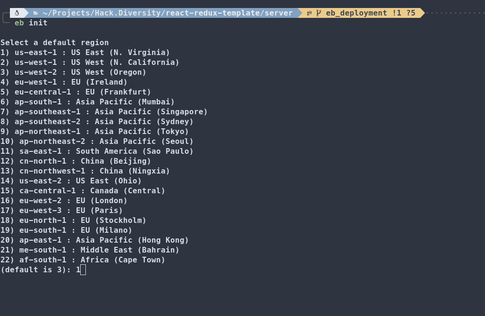
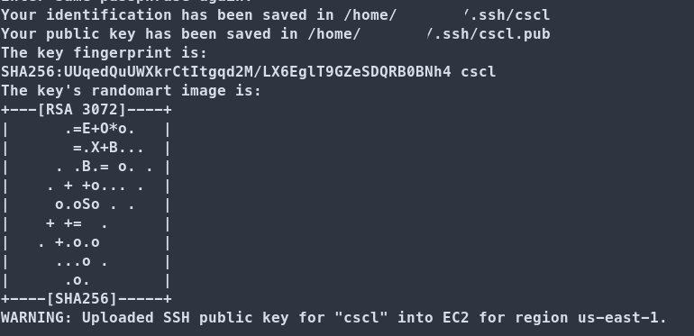
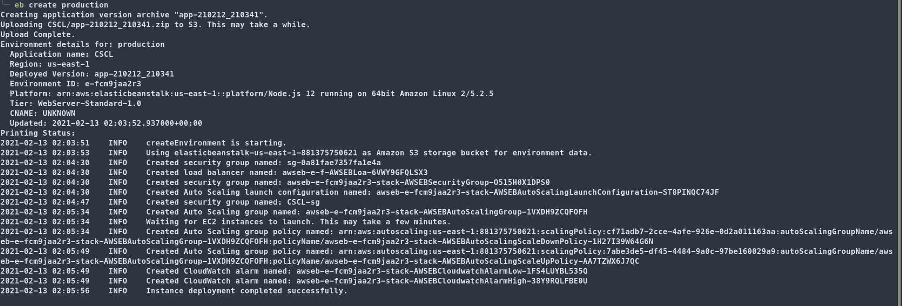

# Creating Your Elastic Beanstalk Environment

Now that you have the EB CLI  installed, you will be able to push your Backend (Server) code to Elastic Beanstalk in your AWS account. 

Note that all of the following will take place withing the `server` directory.

## Initializing Your Elastic Beanstalk Project

Initializing your Elastic Beanstalk project will create a `.elasticbeanstalk` folder which will contain a configuration file with information about your EB deployment.

 
1) Run the `eb init` command which will prompt you for a few questions. You make your selection by typing the matching number or character and pressing "Enter".  
 Make sure to select the "US East (N. Virginia)" option which should be #1.

 
2) You will now be prompted to either create an application or select an existing on. Enter the number for "Create a new Application"

 
3) Next you will be prompted to enter the name of your project. In this example "CSCL" was used. Feel free to use a different name.

 
4) Now you will be asked if you are "using Node.js", enter `y` or "yes". Next, choose the "Node.js 12" option which should be #1.

 
5)  You will be prompted to create an "SSH key pair". Enter `y`to accept. When prompted for a name, you must enter the same name that was referenced earlier in the deployment. Since we used "CSCL" earlier, it should be "cscl".

 
6) You will be prompted to enter a passphrase. Press "Enter" two times to enter a blank passphrase if you don't wish to use one. Setting a passphrase will require you to enter it whenever you attempt to connect to your server using SSH.

 
7) Congrats! Your EB environment has been initialized locally. You will notice a new folder called `elasticbeanstalk` which will contain your configuration file.

## Creating your EB environment in AWS

Now that your configuration has been initialized. The EB CLI will use your config in `.elasticbeanstalk` and the deployment configs in `.ebextensions` to create your environment.

 
Making sure that you are still in the `server` directory. Run the `eb crreate` command followed by the name of the environment you are creating. You will be able to create multiple environments and also delete it later. So don't worry if you need to change the name.

Once you kick off the deployment, EB CLI will display the log events on your console. This can take a few minutes, so feel free to check back later.

Once finished you will be presented with the output.

 
 
This deployment create the following resources:

- API Gateway: Used to proxy (pass along) your HTTP requests to your Beanstalk server. This allows you to connect using HTTPS which will allow your Frontend to call your Backend server without generating any security errors.

- EC2 Instance running MongoDB: This server is using a Bitnami Image containing MongoDB. This is where your database will live.

- Elastic Beanstalk deployment: This represents a number of resources which include an EC2 instance where your code will be running.

## Updating the Code

Whenever you are ready to update your code on AWS. Run the `eb deploy` command. You can provide an environment name if you have more than one using `eb deploy <environment name>`.

---

Next:  [Setting Up Mongo](../03_Setting_Up_Mongo/README.md)
